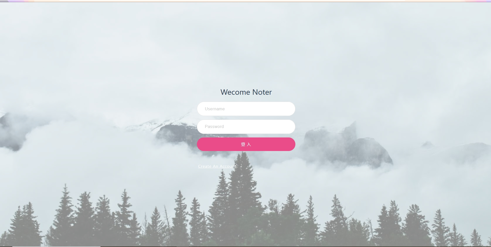
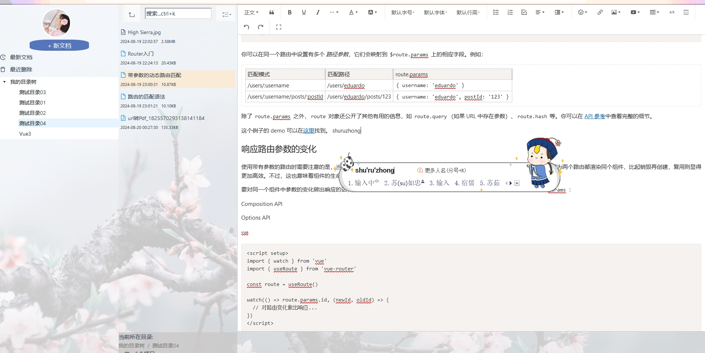
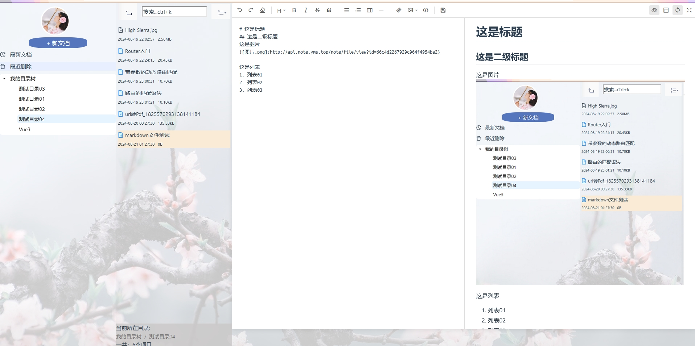
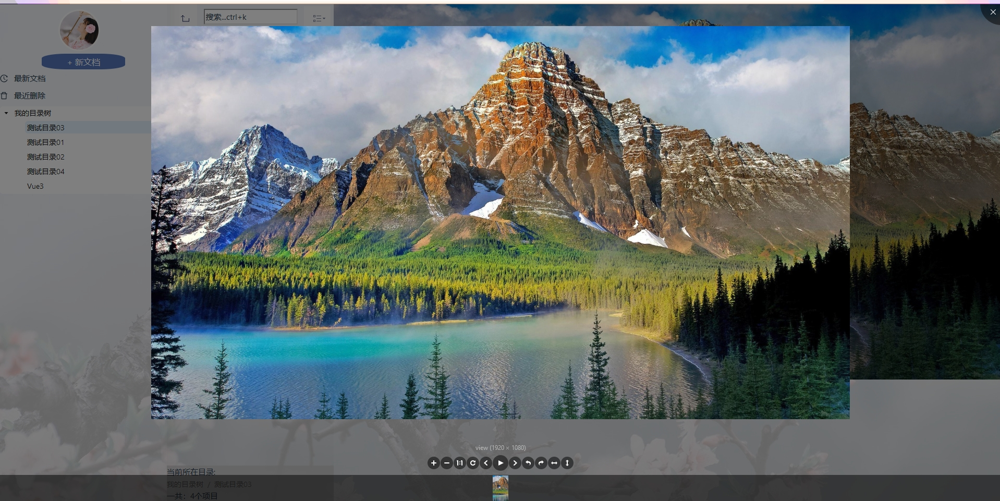
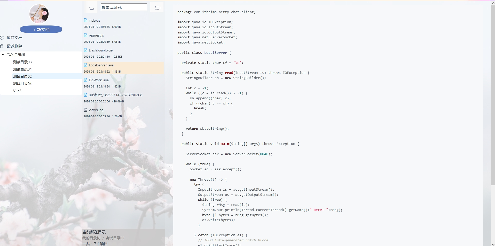
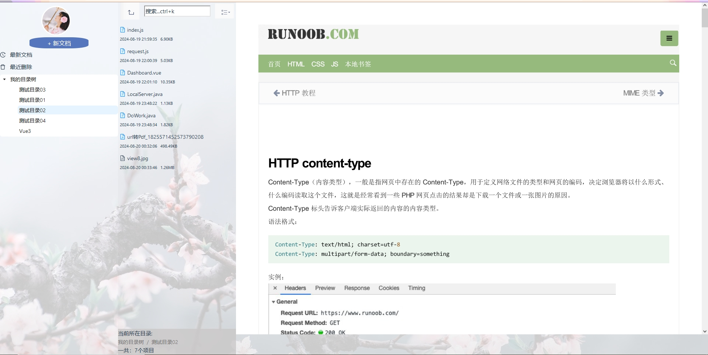

# my-note-view
###  实现类似有道云笔记的前端页面
1. 目前笔记具备tree目录树,文件列表,文件搜索,文件显示等功能。
2. tree目录树使用蚂蚁组件；笔记显示及编辑主要采用markdwon和wangeditor组件。tinymce暂不使用。
3. 同时支持pdf, office(xlsx,docx),图片文件格式数据显示
4. 支持笔记全文搜索(lucene)
5. 支持任意笔记文件上传

### 效果展示




图片

代码

pdf



### 服务端程序
地址：[my-note-server](https://github.com/yangmingsen/my-note-server)

## Recommended IDE Setup

[VSCode](https://code.visualstudio.com/) + [Volar](https://marketplace.visualstudio.com/items?itemName=Vue.volar) (and disable Vetur).

## Customize configuration

See [Vite Configuration Reference](https://vitejs.dev/config/).

## Project Setup

```sh
npm install
```

### Compile and Hot-Reload for Development

```sh
npm run dev
```

### Compile and Minify for Production

```sh
npm run build
```
